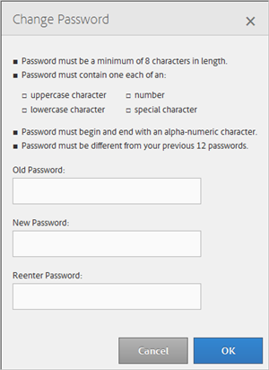

# 내 프로필 {#my-profile}

Audience Manager 관리 도구 프로필의 세부 사항을 편집하거나 암호를 변경합니다.

<!-- c_my_profile.xml -->

## 프로필 편집 {#edit-profile}

이름과 성, 사용자 이름, 이메일 주소, 전화 번호, [!UICONTROL IMS ID], 사용자 역할 및 상태를 포함한 Audience Manager 관리 도구 프로필을 보고 편집합니다.

<!-- t_edit_profile.xml -->

1. **[!UICONTROL My Profile]** 아이콘을 클릭합니다.

   

2. 다음 필드를 채웁니다.
   * **[!UICONTROL First Name]:**(필수) 이름을 지정하십시오.
   * **[!UICONTROL Last Name]:**(필수) 성을 지정하십시오.
   * **[!UICONTROL Username]:**(필수) 첫 번째 사용자 이름을 지정합니다.
   * **[!UICONTROL Email Address]:**(필수) 전자 메일 주소를 지정합니다.
   * **[!UICONTROL Phone Number]:** 전화 번호를 지정하십시오.
   * **[!UICONTROL IMS ID]:** 인터넷 메시징 서비스 ID를 지정하십시오.
   * **[!UICONTROL User Roles]:** 원하는 사용자 역할을 선택합니다.
      * **[!UICONTROL DEXADMIN]:** Audience Manager 관리 도구에서 작업을 수행하기 위한 관리자 액세스 권한을 제공합니다. 이 옵션을 선택하지 않으면 개별 역할을 선택할 수 있습니다. 이러한 역할을 통해 사용자는 [!DNL API] 호출을 사용하여 작업을 수행할 수 있지만 관리 도구에서는 수행할 수 없습니다.
      * **[!UICONTROL CREATE_USERS]:** 사용자가 [!DNL API] 호출을 사용하여 새 사용자를 만들 수 있습니다.
      * **[!UICONTROL DELETE_USERS]:** 사용자가 [!DNL API] 호출을 사용하여 기존 사용자를 삭제할 수 있도록 허용합니다.
      * **[!UICONTROL EDIT_USERS]:** 사용자가 [!DNL API] 호출을 사용하여 기존 사용자를 편집할 수 있도록 허용합니다.
      * **[!UICONTROL VIEW_USERS]:** 사용자가 [!DNL API] 호출을 사용하여 Audience Manager 구성에서 다른 사용자를 볼 수 있습니다.
      * **[!UICONTROL CREATE_PARTNERS]:** 사용자가 [!DNL API] 호출을 사용하여 Audience Manager 파트너를 만들 수 있습니다.
      * **[!UICONTROL DELETE_PARTNERS]:** 사용자가 [!DNL API] 호출을 사용하여 Audience Manager 파트너를 삭제할 수 있습니다.
      * **[!UICONTROL EDIT_PARTNERS]:** 사용자가 [!DNL API] 호출을 사용하여 Audience Manager 파트너를 편집할 수 있습니다.
      * **[!UICONTROL VIEW_PARNTERS]:** 사용자가 [!DNL API] 호출을 사용하여 Audience Manager 파트너를 볼 수 있습니다.
   * **[!UICONTROL Status]:** 원하는 상태를 선택합니다.
      * **[!UICONTROL Active]:** 이 사용자를 활성 Audience Manager 사용자로 지정합니다.
      * **[!UICONTROL Deactivated]:** 이 사용자가 Audience Management에서 비활성화된 사용자임을 지정합니다.
      * **[!UICONTROL Expired]:** Audience Manager에서 이 사용자의 계정이 만료되도록 지정합니다.
      * **[!UICONTROL Locked Out]:** Audience Manager에서 이 사용자의 계정이 잠기도록 지정합니다.
3. **[!UICONTROL Submit]** 아이콘을 클릭합니다.

## 암호 변경 {#change-password}

Audience Manager 관리 도구 암호를 변경합니다.

<!-- t_change_password.xml -->

1. **[!UICONTROL My Profile]** 아이콘을 클릭합니다.
1. **[!UICONTROL Change Password]** 아이콘을 클릭합니다.

   

   Audience Manager 암호는 다음과 같아야 합니다.

   * 문자 길이가 8자 이상;
   * 대문자를 하나 이상 포함해야 합니다.
   * 소문자를 하나 이상 포함해야 합니다.
   * 숫자를 하나 이상 포함해야 합니다.
   * 하나 이상의 특수 문자를 포함해야 합니다.
   * 영숫자로 시작하고 끝나야 합니다.
   * 영숫자로 시작하고 끝나야 합니다.

1. 이전 암호를 지정하십시오.
1. 새 암호를 지정한 다음 새 암호를 확인합니다.
1. **[!UICONTROL OK]** 아이콘을 클릭합니다.
