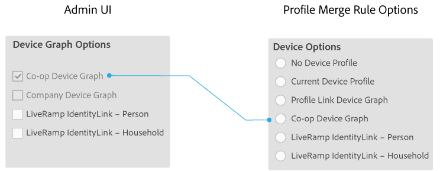

# 회사를 위한 장치 그래프 옵션 {#device-graph-options-for-companies}

[!UICONTROL Device Graph Options]은(는) [!DNL Adobe Experience Cloud Device Co-op]에 참여하는 회사에서 사용할 수 있습니다. 고객이 또한 Audience Manager과 통합된 서드파티 장치 그래프 제공자와 계약 관계에 있는 경우 이 섹션에는 해당 장치 그래프에 대한 옵션이 표시됩니다. 이러한 옵션은 [!UICONTROL Companies] > 회사 이름 > [!UICONTROL Profile] > [!UICONTROL Device Graph Options]에 있습니다.

이 그림에서는 타사 장치 그래프 옵션에 일반 이름을 사용합니다. 프로덕션에서 이러한 이름은 Device Graph 공급자에서 가져오며 여기에 표시된 것과 다를 수 있습니다. 예를 들어 [!DNL LiveRamp] 옵션은 일반적으로(항상 있는 것은 아님):

* &quot;[!DNL LiveRamp]&quot;(으)로 시작
* 다양한 가운데 이름 포함
* &quot;[!UICONTROL - Household]&quot; 또는 &quot;[!UICONTROL -Person]&quot;(으)로 종료

## 장치 그래프 옵션 정의됨 {#device-graph-options-defined}

여기에서 선택한 장치 그래프 옵션은 [!UICONTROL Device Options] 고객이 [!DNL Audience Manager]을(를) 만들 때 사용할 수 있는 [!UICONTROL Profile Merge Rule] 선택 사항을 노출하거나 숨깁니다.

### Co-op 장치 그래프 {#co-op-graph}

[Adobe Experience Cloud Device Co-op](https://experienceleague.adobe.com/docs/device-co-op/using/about/overview.html?lang=ko)에 참여하는 고객은 이러한 옵션을 사용하여 [!UICONTROL Profile Merge Rule]결정론적 및 확률론적 데이터[를 사용하는 &#x200B;](https://experienceleague.adobe.com/docs/device-co-op/using/device-graph/links.html?lang=ko)을(를) 만듭니다. [!DNL Corporate Provisioning Team]은(는) 백 엔드 [!DNL API] 호출을 통해 이 옵션을 활성화하고 비활성화합니다. [!DNL Admin UI]에서 이 상자를 선택하거나 지울 수 없습니다. 또한 **[!UICONTROL Co-op Device Graph]** 및 **[!UICONTROL Company Device Graph]** 옵션은 함께 사용할 수 없습니다. 고객은 둘 중 하나를 활성화하도록 요청할 수 있지만 둘 다 활성화하지는 않습니다. 이 옵션을 선택하면 **[!UICONTROL Co-op Device Graph]**&#x200B;에 대한 [!UICONTROL Device Options] 설정의 [!UICONTROL Profile Merge Rule] 컨트롤이 표시됩니다.

### 회사 장치 그래프 {#company-graph}

이 옵션은 [!DNL Analytics] 보고서 세트에서 [!UICONTROL People] 지표를 사용하는 [!DNL Analytics] 고객을 위한 것입니다. [!DNL Corporate Provisioning Team]은(는) 백 엔드 [!DNL API] 호출을 통해 이 옵션을 활성화하고 비활성화합니다. [!DNL Admin UI]에서 이 상자를 선택하거나 지울 수 없습니다. 또한 **[!UICONTROL Company Device Graph]** 및 **[!UICONTROL Co-op Device Graph]** 옵션은 함께 사용할 수 없습니다. 고객은 둘 중 하나를 활성화하도록 요청할 수 있지만 둘 다 활성화하지는 않습니다. 확인 시:

* 이 장치 그래프는 구성할 회사에 속하는 결정론적 데이터를 사용합니다(확률론적 데이터 없음).
* [!DNL Audience Manager]이(가) [!UICONTROL Data Source]파트너 이름`*`이라는 `*-Company Device Graph-Person`을(를) 자동으로 만듭니다. [!UICONTROL Data Source] 세부 정보 페이지에서 [!DNL Audience Manager] 고객은 파트너 이름, 설명을 변경하고 이 데이터 원본에 [데이터 내보내기 제어](https://experienceleague.adobe.com/docs/device-co-op/using/device-graph/links.html?lang=ko)를 적용할 수 있습니다.
* [!DNL Audience Manager] 고객 *새 설정을*&#x200B;에 대한 [!UICONTROL Device Options] 섹션에서 볼 수 없음[!UICONTROL Profile Merge Rule].

### LiveRamp 장치 그래프(개인 또는 세대) {#liveramp-device-graph}

이 확인란은 파트너가 [!DNL Admin UI]을(를) 만들고 [!UICONTROL Data Source] 및/또는 **[!UICONTROL Use as an Authenticated Profile]**&#x200B;을(를) 선택할 때 **[!UICONTROL Use as a Device Graph]**&#x200B;에서 활성화됩니다. 이러한 설정의 이름은 타사 장치 그래프 공급자(예: [!DNL LiveRamp], [!DNL TapAd] 등)에 의해 결정됩니다. 선택하면 구성하려는 회사에서 이러한 장치 그래프에서 제공하는 데이터를 사용하게 됩니다.

>[!MORELIKETHIS]
>
>* [정의된 프로필 병합 규칙 옵션](https://experienceleague.adobe.com/docs/audience-manager/user-guide/features/profile-merge-rules/merge-rule-definitions.html?lang=ko)
>* [데이터 Source 설정 및 메뉴 옵션](https://experienceleague.adobe.com/docs/audience-manager/user-guide/features/data-sources/datasources-list-and-settings.html?lang=ko)
