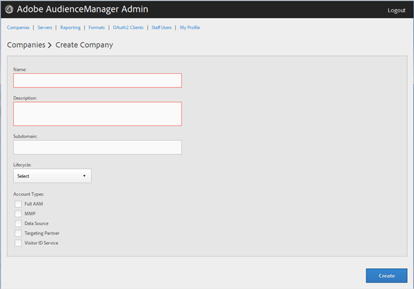

# 회사 프로필 만들기 {#create-a-company-profile}

Audience Manager 관리 도구의 [!UICONTROL Companies] 페이지를 사용하여 새 회사를 만드십시오.

<!-- t_create_company.xml -->

>[!NOTE]
>
>새 회사를 만들려면 **[!UICONTROL DEXADMIN]** 역할이 있어야 합니다.

1. **[!UICONTROL Companies]** > **[!UICONTROL Add Company]**&#x200B;을(를) 클릭합니다.
1. 다음 필드를 채웁니다.

   * **[!UICONTROL Name]**: (필수) 회사 이름을 지정합니다.
   * **[!UICONTROL Description]**: (필수) 업종 또는 전체 이름 등 회사에 대한 설명 정보를 제공합니다.
   * **[!UICONTROL Subdomain]**: (필수) 회사의 하위 도메인을 지정합니다. 입력한 텍스트는 이벤트 호출의 하위 도메인으로 표시됩니다. 이는 변경할 수 없습니다. [!DNL URL]자 문자열이어야 합니다.

     예를 들어 회사 이름이 [!DNL AcmeCorp]인 경우 하위 도메인은 [!DNL acmecorp]입니다.

     Audience Manager은 [!UICONTROL Data Collection Server]&#x200B;(DCS)에 하위 도메인을 사용합니다. 앞의 예제에서 회사의 [!UICONTROL DCS]에 있는 전체 [!DNL URL]은(는) [!DNL acmecorp.demdex.net]입니다.

   * **[!UICONTROL Lifecyle]**: 회사에 대해 원하는 단계를 지정하십시오.
      * **[!UICONTROL Active]**: 회사가 활성 Audience Manager 클라이언트가 되도록 지정합니다. [!UICONTROL Active] 계정은 컨설팅뿐만 아니라 Audience Manager SKU를 위한 유료 고객을 의미합니다.
      * **[!UICONTROL Demo]**: 데모 목적으로만 회사를 지정하십시오. 보고 데이터가 자동으로 가짜 처리됩니다.
      * **[!UICONTROL Prospect]**: 회사에 무료 [!DNL POC]이(가) 제공되거나 영업 데모용 계정이 설정되는 등 회사가 Audience Manager의 잠재 고객임을 지정하십시오.
      * **[!UICONTROL Test]**: 회사가 내부 테스트 목적으로만 사용되도록 지정하십시오.

   * **[!UICONTROL Account Types]**: 이 회사에 대한 전체 계정 유형 집합을 지정하십시오. 다른 유형과 함께 사용할 수 없는 계정 유형은 없습니다.
      * **[!UICONTROL Full AAM]**: 회사에 전체 Adobe Audience Manager 계정이 있고 사용자가 로그인 액세스 권한을 갖도록 지정하십시오.
      * **[!UICONTROL MMP]**: 회사에서 [!UICONTROL Master Marketing Profile]&#x200B;([!UICONTROL MMP]) 기능을 사용할 수 있도록 설정되었는지 지정하십시오. [!UICONTROL MMP]을(를) 사용하면 모든 방문자에게 할당되어 Audience Manager에서 사용하는 [!UICONTROL Experience Cloud ID]&#x200B;([!DNL MCID])을(를) 사용하여 Experience Cloud에서 대상을 공유할 수 있습니다. 이 계정 유형을 선택하면 [!UICONTROL Experience Cloud ID Service]도 자동으로 선택됩니다.

        자세한 내용은 [Experience Cloud 대상](https://experienceleague.adobe.com/docs/core-services/interface/services/audiences/audience-library.html?lang=ko)을 참조하세요.

   * **[!UICONTROL Data Source]**: 회사가 Audience Manager 내의 타사 데이터 공급자임을 지정합니다.
   * **[!UICONTROL Targeting Partner]**: 회사가 Audience Manager 고객을 위한 타기팅 플랫폼으로 작동하도록 지정합니다.
   * **[!UICONTROL Visitor ID Service]**: 회사에서 [!UICONTROL Experience Cloud Visitor ID Service]을(를) 사용할 수 있도록 설정되었는지 지정하십시오.

     [!UICONTROL Experience Cloud Visitor ID Service]은(는) Experience Cloud 솔루션에서 유니버설 방문자 ID를 제공합니다. 자세한 내용은 [Experience Cloud 방문자 ID 서비스 사용 안내서](https://experienceleague.adobe.com/docs/id-service/using/intro/overview.html?lang=ko)를 참조하십시오.

   * **[!UICONTROL Agency]**: 회사에 [!UICONTROL Agency] 계정이 있는지 지정하십시오.

1. **[!UICONTROL Create]** 아이콘을 클릭합니다. [회사 프로필 편집](../companies/admin-manage-company-profiles.md#edit-company-profile)의 지침을 따라 계속합니다.

   

## 회사 프로필 편집 {#edit-company-profile}

이름, 설명, 하위 도메인, 라이프사이클 등을 포함한 회사 프로필을 편집합니다.

<!-- t_edit_company_profile.xml -->

1. **[!UICONTROL Companies]**&#x200B;을(를) 클릭한 다음 원하는 회사를 찾아 클릭하여 [!UICONTROL Profile] 페이지를 표시합니다.

   [!UICONTROL Search] 상자나 목록 하단의 페이지 매김 컨트롤을 사용하여 원하는 회사를 찾습니다. 원하는 열의 헤더를 클릭하여 각 열을 오름차순 또는 내림차순으로 정렬할 수 있습니다.

   

1. 필요에 따라 필드를 편집합니다.

   * **[!UICONTROL Name]**: 회사 이름을 편집합니다. 필수 필드입니다.
   * **[!UICONTROL Description]**: 회사의 설명을 편집합니다. 필수 필드입니다.
   * **[!UICONTROL Subdomain]**: (필수) 회사의 하위 도메인을 지정합니다. 입력한 텍스트는 이벤트 호출의 하위 도메인으로 표시됩니다. 이는 변경할 수 없습니다. [!DNL URL]자 문자열이어야 합니다.

     예를 들어 회사 이름이 [!DNL AcmeCorp]인 경우 하위 도메인은 [!DNL acmecorp]입니다.

     Audience Manager은 [!UICONTROL Data Collection Server]&#x200B;(DCS)에 하위 도메인을 사용합니다. 앞의 예제에서 회사의 [!UICONTROL DCS]에 있는 전체 [!DNL URL]은(는) [!DNL acmecorp.demdex.net]입니다.

   * **[!UICONTROL imsOrgld]**: ([!UICONTROL Identity Management System Organization ID]) 이 ID를 사용하면 귀사를 Adobe Experience Cloud에 연결할 수 있습니다.
   * **[!UICONTROL Lifecyle]**: 회사에 대해 원하는 단계를 지정하십시오.
      * **[!UICONTROL Active]**: 회사가 활성 Audience Manager 클라이언트가 되도록 지정합니다. 활성 계정은 컨설팅 뿐만 아니라 Audience Manager SKU에 대한 유료 고객을 의미합니다.
      * **[!UICONTROL Demo]**: 데모 목적으로만 회사를 지정하십시오. 보고 데이터가 자동으로 가짜 처리됩니다.
      * **[!UICONTROL Prospect]**: 회사에 무료 [!DNL POC]이(가) 제공되거나 영업 데모용 계정이 설정되는 등 회사가 Audience Manager의 잠재 고객임을 지정하십시오.
      * **[!UICONTROL Test]**: 회사가 내부 테스트 목적으로만 사용되도록 지정하십시오.
   * **[!UICONTROL Account Types]**: 이 회사에 대한 전체 계정 유형 집합을 지정하십시오. 다른 유형과 함께 사용할 수 없는 계정 유형은 없습니다.
      * **[!UICONTROL Full AAM]**: 회사에 전체 Adobe Audience Manager 계정이 있고 사용자가 로그인 액세스 권한을 갖도록 지정하십시오.
      * **[!UICONTROL MMP]**: 회사가 기본 마케팅 프로필([!UICONTROL MMP]) 기능을 사용할 수 있도록 설정되어 있는지 지정하십시오.

        이 계정 유형을 선택하면 **[!UICONTROL Visitor ID Service]**&#x200B;도 자동으로 선택됩니다.
자세한 내용은 [Experience Cloud 대상](https://experienceleague.adobe.com/docs/core-services/interface/services/audiences/audience-library.html?lang=ko)을 참조하세요.

   * **[!UICONTROL Data Source]**: 회사가 Audience Manager 내의 타사 데이터 공급자임을 지정합니다.
   * **[!UICONTROL Targeting Partner]**: 회사가 Audience Manager 고객을 위한 타기팅 플랫폼으로 작동하도록 지정합니다.
   * **[!UICONTROL Visitor ID Service]**: 회사에서 Experience Cloud 방문자 ID 서비스를 사용하도록 설정했는지 지정하십시오.

     Experience Cloud 방문자 ID 서비스는 Experience Cloud 솔루션 전반에 유니버설 방문자 ID를 제공합니다. 자세한 내용은 [Experience Cloud ID 서비스 사용 안내서](https://experienceleague.adobe.com/docs/id-service/using/home.html?lang=ko)를 참조하십시오.

   * **[!UICONTROL Agency]**: 회사에 Agency 계정이 있는지 지정하십시오.
   * **[!UICONTROL Features]**: 원하는 옵션을 선택합니다.
      * **[!UICONTROL Password Expiration]**: 이 회사 내의 모든 사용자 암호가 90일 후에 만료되도록 설정하여 Audience Manager 보안을 강화합니다.
      * **[!UICONTROL Reporting]**: 이 회사에 대해 Audience Manager 보고를 사용합니다.
      * **[!UICONTROL Role Based Access Controls]**: 이 회사에 대해 역할 기반 액세스 제어를 사용하도록 설정합니다. 역할 기반 액세스 제어를 사용하면 다양한 액세스 권한을 가진 사용자 그룹을 만들 수 있습니다. 그런 다음 이러한 그룹 내의 개별 사용자는 Audience Manager의 특정 기능에만 액세스할 수 있습니다.

1. **[!UICONTROL Submit Updates]** 아이콘을 클릭합니다.

## 회사 프로필 삭제 {#delete-company-profile}

Audience Manager [!UICONTROL Admin] 도구의 [!UICONTROL Companies] 페이지를 사용하여 기존 회사를 삭제합니다.

<!-- t_delete_company.xml -->

>[!NOTE]
>
>기존 회사를 삭제하려면 [!UICONTROL DEXADMIN] 역할이 있어야 합니다.

1. 기존 회사를 삭제하려면 **[!UICONTROL Companies]**&#x200B;을(를) 클릭합니다.

   

1. 원하는 회사의 **[!UICONTROL Actions]** 열에서 을(를) 클릭합니다.
1. **[!UICONTROL OK]**&#x200B;을(를) 클릭하여 삭제를 확인합니다.
