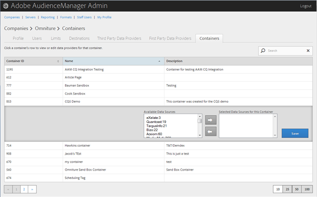

# 컨테이너 관리 {#manage-containers}

컨테이너의 데이터 공급자를 보거나 편집합니다.

<!-- t_containers.xml -->

>[!NOTE]
>
>기본적으로 회사는 하나의 컨테이너로 생성됩니다. **[!UICONTROL Tools > Tags]**&#x200B;의 사용자 인터페이스에서 회사에 대한 추가 컨테이너를 만들 수 있습니다.

1. **[!UICONTROL Companies]**&#x200B;을(를) 클릭한 다음 원하는 회사를 찾아 클릭하여 [!UICONTROL Profile] 페이지를 표시합니다.

   [!UICONTROL Search] 상자나 목록 하단의 페이지 매김 컨트롤을 사용하여 원하는 회사를 찾습니다. 원하는 열의 헤더를 클릭하여 각 열을 오름차순 또는 내림차순으로 정렬할 수 있습니다.

1. **[!UICONTROL Containers]** 탭을 클릭합니다.

   

1. 컨테이너의 행을 클릭하여 해당 컨테이너의 데이터 공급자를 보거나 편집합니다.

   

1. 원하는 데이터 원본을 선택한 다음 필요에 따라 오른쪽 또는 왼쪽 화살표를 클릭하여 **[!UICONTROL Available Data Sources]** 및 **[!UICONTROL Selected Data Sources for This Container]** 목록에서 데이터 원본을 이동합니다.

   [타사 데이터 공급자](../companies/admin-third-party-providers.md#task_E942DD674D794BA6B8EFD52FD866E689) 페이지에서 이 작업을 수행할 수도 있습니다.

1. 변경한 경우 **[!UICONTROL Save]**&#x200B;을(를) 클릭합니다.

>[!MORELIKETHIS]
>
>* [Media Optimizer와 ID 동기화](../companies/admin-amo-sync.md#concept_2B5537233DAA4860B3503B344F937D83)
